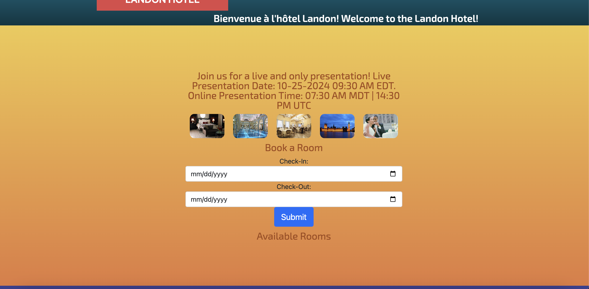

# D387 Final Project

Created by Nate Edge

Western Governor's University
Course D387 - Advanced Java 

# *Landon Hotel: Scheduling App*

**Application Description:** This is a modified full-stack scheduling application for the Landon Hotel.
It has an Angular front-end built with TypeScript and Angular, and a Java / Spring Boot backend.

# Created Packages:
src > main > java > edu.wgu* > il8n (Internalization)
<ul>
<li>Presentation Controller</li>
<li>Time Zone Conversion</li>
<li>Welcome Controller</li>
<li>Welcome Message</li>
</ul>
src > main > resources > Resource Bundle 
<ul>
<li>welcome_en_US.properties</li>
<li>welcome_fr_CA.properties</li>
</ul>

target 
<ul>
<li>D387_sample_code-0.0.2-SNAPSHOT.jar</li>
<li>D387_sample_code-0.0.2-SNAPSHOT.jar.original</li>
</ul>

src > main > resources > static > screenshots
<ul>
<li>All screenshots included in this directory</li>
</ul>

Dockerfile

# Modified Code: 
UI > src > app
<ul>
<li>app.component.html</li>
<li>app.component.ts</li>
<li>app.component.css</li>
</ul>

# Code Description (Rubric Requirements)
**(A) Create a subgroup and project in GitLab.** The project can be found at 
[this repo](https://gitlab.com/wgu-gitlab-environment/student-repos/nate_edge/d387-advanced-java.git)
inside working_branch.

**(B) Modify the Landon Hotel scheduling application for localization and internationalization by doing the following:**
1. The resource bundles can be found in main > resources (welcome_en_US and welcome_fr_CA). The code to display the
welcome message is found inside il8n > WelcomeMessage. This class contains a message executor and welcomeMessage() method
that will display a multi-threaded welcome message in both French and English. This application uses a Rest Controller, 
found in WelcomeController, to call the welcomeMessage method on the front end. The front end contains modifications in both
main > UI > src > app (app.component.ts and app.component.html). The Typescript changes can be found on Lines 33, 41, 42, and 48-51
of the TypeScript component. The modified HTML displays the welcome message on Line 18 of the HTML component. The welcome message
includes a CSS keyframes animation, found in the CSS component on Lines 943-964. 

**PLEASE NOTE:** Multi-threading can sometimes be delayed. If the welcome message is only seen in one language, please refresh 
the browser.

2. The front end includes modifications to the TypeScript and CSS components to display room rates in USD, CAD, and EUR. The 
TypeScript component includes a convertPrice() method which leverages switch / case statements to convert currency rates based on 
the currency form. It also uses a getCurrencySymbol() method, also leverage switch case statements, to associate each currency form 
with the appropriate symbol. It also uses a getFormattedPrice() method to associate each currency rate with the appropriate room number. 
These changes can be found in the TypeScript component on Lines 119 - 146. The getFormattedPrice() method is called inside the HTML component
to display all three currency rates on the front-end. These changes can be found in the HTML component on Lines 80-82.
     
3. An announcement for a live and online presentation is also displayed on the front-end application. The app uses a backend class 
inside of the il8n directory called TimeZoneConversion to create a message and convert the date and times from EDT to MDT and UTC. 
The class also uses a displayPresentation() method to display the presentation announcement. The presentation announcement is called 
using a REST Controller called PresentationController (also found in the il8n directory). The front-end subscribes to the displayPresentation 
component via the Rest Controller. These changes can be found inside of the TypeScript component on Lines 34, 36, 37, and 55-58. The message
is displayed in the HTML component on Line 30.

**(C):** The Dockerfile is found inside the root directory. It exposes Port 8080 for running on Docker Desktop. The Dockerfile uses 
the .jar file found in the target directory (D387_sample_code-0.0.2-SNAPSHOT.jar). A docker image can be created by running the following command 
inside the root directory: <i>docker build -t your-image-name .</i> 

The application successfully ran inside a Docker container, created and run in Docker Desktop. Screenshots of the containerized application are
included in the screenshots section below.

You can also run the docker image directly from your CLI in IntelliJ by using the command <i>docker run -p 8080:8080 your-image-name</i>. This command runs
the image and directs the image to port 8080.

Instructions for deploying the containerized application on the cloud can be found in the submitted PDF, <i>D387 Cloud Deployment</i>.

# Screenshots

